

# Servicing Peripheral Interrupts While Writing Flash
This example shows how to use the Read-While-Write (RWW) feature on supported AVR® devices. It will demonstrate how the CPU halts when writing without the RWW and how it runs using the RWW. In this example, the drivers are generated using MPLAB® Code Configurator (MCC).

The Microchip AVR® EA Family of microcontrollers features Flash memory where the Flash divides in two sections: the Read-While-Write (RWW) section and Non Read-While-Write (NRWW). This enables the CPU to continue running instructions in the NRWW section while a Flash write is executed on the RWW section.

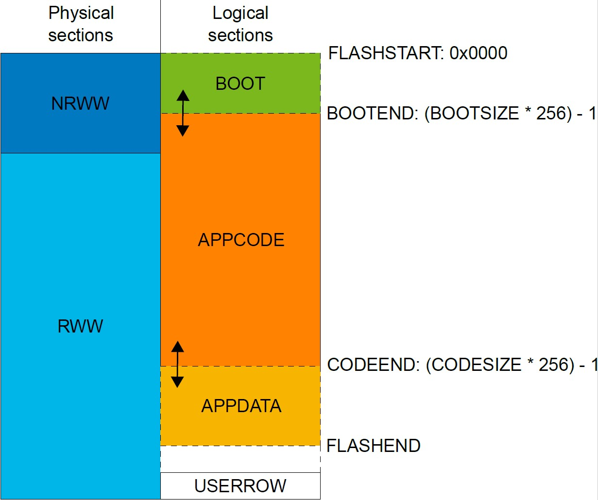

The Memory Overview table in the part datasheet shows the available sizes for NRWW and RWW. The logical BOOT section size can overlap a part of the NRWW section or all of it, as shown below.

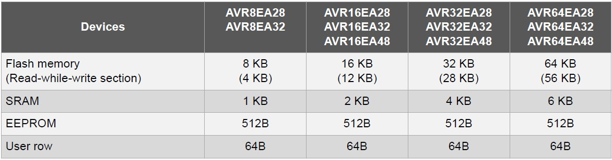

The Flash memory read/write routines are placed in the NRWW section using an application. This allows the CPU to run while such procedures are in progress. The application has several use cases, such as:
1. A Bootloader scenario, where CPU is servicing commands from communication peripheral (I2C/USART) to the Host programmer and simultaneously programming the RWW sections containing application Code/Data.
2. A data logging scenario, where an analog peripheral interrupts regularly with a stream of data that needs to be stored to program memory without halting the CPU.
   
In both use cases, the CPU must not be halted while the NVMCTRL peripheral performs the operation on program memory.

## Related Documentation
## Software Used
- [MPLAB® X IDE 6.15](https://www.microchip.com/en-us/development-tools-tools-and-software/mplab-x-ide?utm_source=GitHub&utm_medium=TextLink&utm_campaign=MCU8_MMTCha_MPAE_Examples&utm_content=avr64ea48-nvm-read-while-write-mplab-mcc-github) or newer
- [MPLAB® XC8 2.45](https://www.microchip.com/en-us/development-tools-tools-and-software/mplab-xc-compilers?utm_source=GitHub&utm_medium=TextLink&utm_campaign=MCU8_MMTCha_MPAE_Examples&utm_content=avr64ea48-nvm-read-while-write-mplab-mcc-github) or newer compiler
- [Python MCU programmer - pymcuprog](https://pypi.org/project/pymcuprog/)

## Hardware Used
- [AVR64EA48 Curiosity Nano](https://www.microchip.com/en-us/development-tool/EV66E56A)
- Logic analyzer or oscilloscope

## Setup
### Project setup
> Note: \
Interrupt code located in the RWW section may halt the CPU if the associated interrupt is triggered while the RWW section is erased or written. For the CPU to not block while the write operation on RWW program memory is in progress, the code that the CPU reads needs to be located in the NRWW area.

<i>Device Resources</i>

This example uses MCC with the Melody library, as shown below:

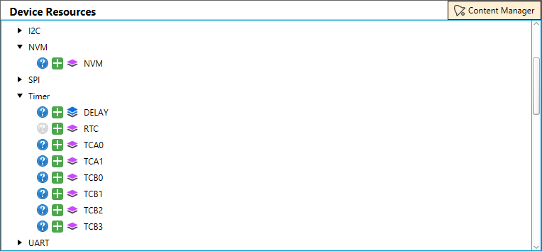

* NVM - Used for Flash access and writing
* TCB0 - Used for filling buffer on interrupt
* TCB1 - Used for debounce on on-board switch

After adding the drivers, they will show up in the Project Resources tab, as shown below. 

<i>Project Resources</i>

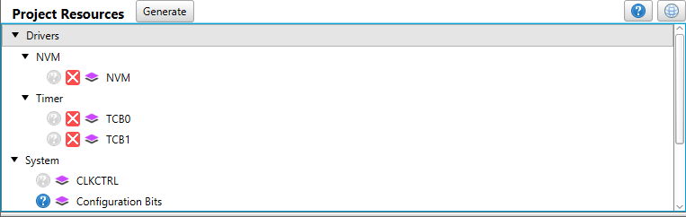

The setup for each driver can be seen below.

  
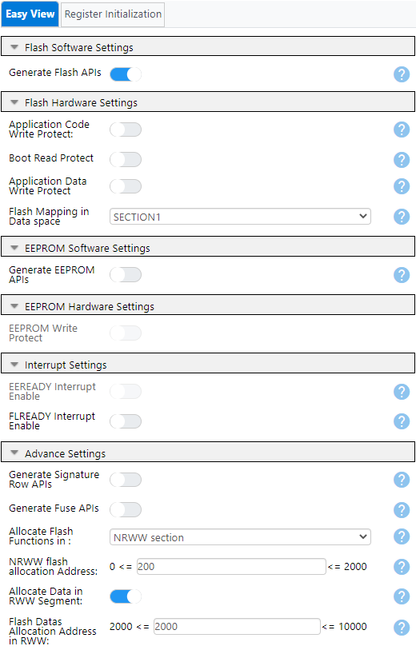
  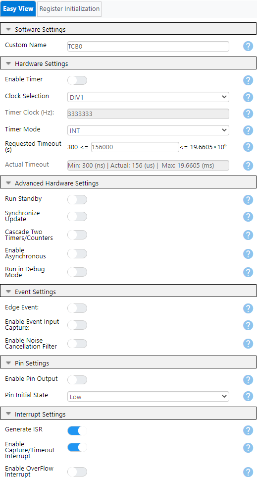
  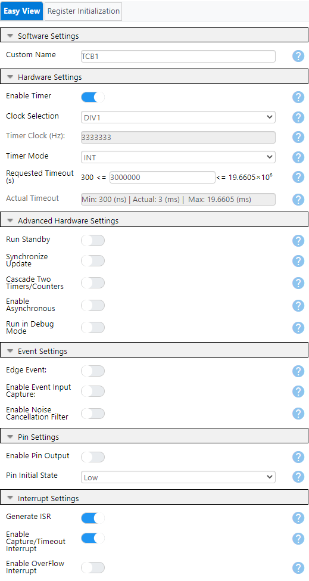

The setup can also be verified in the Builder pane and may look like the picture below.

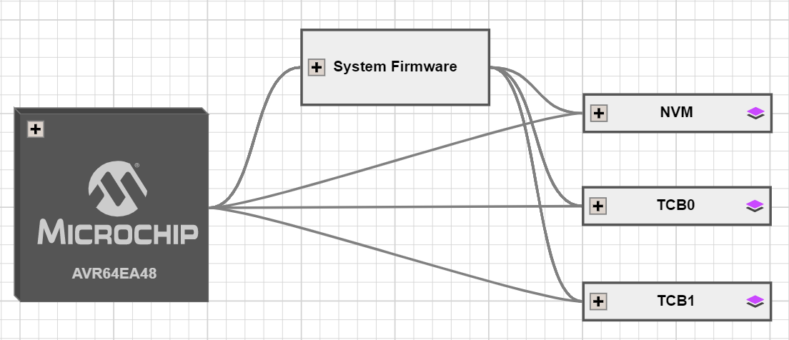

The above settings result in a pin configuration as seen below.

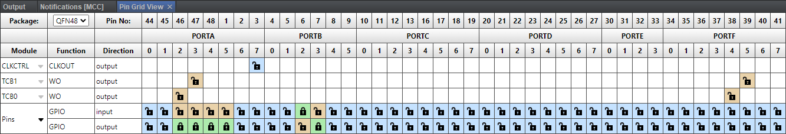

The output and input pins are named to make the code readable.

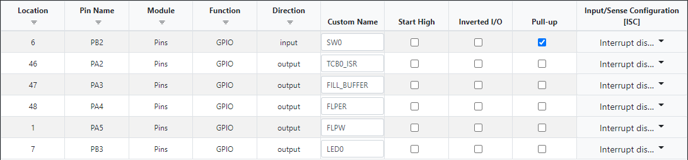

### Moving the Interup Vector Table
If it is configured to exist, the default settings places the interrupt vectors at the start of the APPCODE section. Therefor, the interrupts will not run if the Flash controller writes to that Flash section, even if the NRWW section overlaps a part of the APPCODE section. To ensure that uninterrupted interrupt handling can take place, the interrupt vector can be placed in the start of the BOOT section. This is done by setting the IVSEL bit in the CPUINT.CTRLA register. Refer to the CPUINT section for details. If no interrupt source is used, then there is no need to change this value.

Note that when the APPCODE and APPDATA section are configured, the only prerequisite for uninterrupted interrupt handling while Flash writes to the APPDATA section is that the interrupt vector is in the NRWW section.

Functions or interrupts placed in the NRWW section can run while an operation on the RWW section is ongoing. Steps must be taken to prevent the interrupts or jumps for the code located inside the RWW section. Hence, the benefits of the NRWW/RWW split are forfeit.

### Project Properties
#### XC8 Global Options
To use this example, some settings needs to be updated for the project. In the **XC8 Global Options** tab two checkboxes needs to be checked like below.

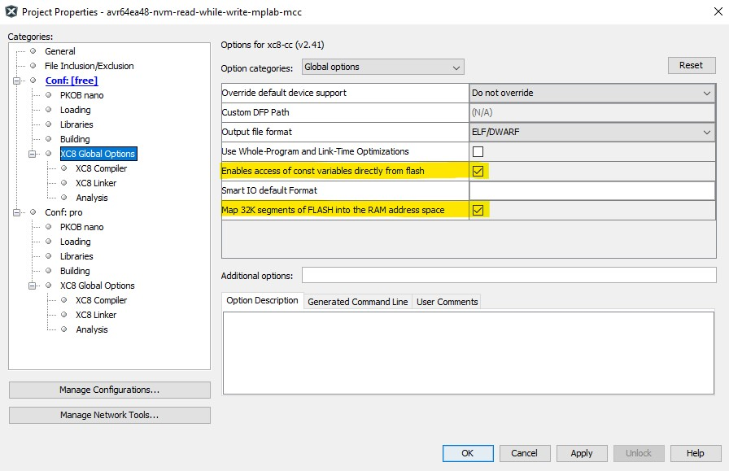

The XC8 Linker options needs to be updated so that we can place code at specific addresses.

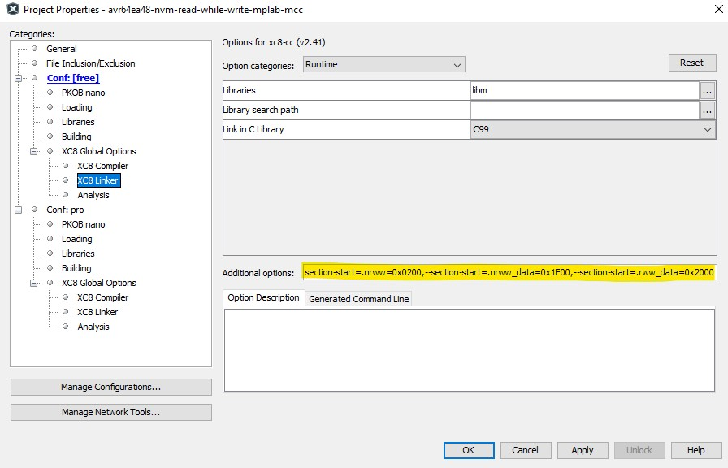

> -Wl,--section-start=.nrww=0x0200,--section-start=.nrww_data=0x1F00,--section-start=.rww_data=0x2000

The settings are instructing the linker that at:
- 0x0200 - section ".nrww" starts
- 0x1F00 - section ".nrww_data" starts
- 0x2000 - section ".rww_data" starts

>Note \
If changing the location and size of the above memory areas, at build time, linker errors might occur. One is advised to throroughly check the length of each area. For example, the linker error below occurs when, erroneously, the ".rww_data" overlapps the ".nrww_data".

> Link Error: Could not allocate section '.rww_data' at 0x1f80
Link Error: Could not allocate program memory
collect2.exe: error: ld returned 1 exit status
make[2]: *** [dist/free/production/avr64ea48-nvm-read-while-write-mplab-mcc.X.production.hex] Error 1
make[1]: *** [.build-conf] Error 2
make: *** [.build-impl] Error 2

#### Physical setup
The example can run without using external tools but is configured to allow for such tools if preferred and to allow viewing the RWW in progress. This is done by setting I/O pins to toggle on important points in code. The four events are, with attached pins:
* TCB0 interrupt trigger (PA2)
* Filling of the buffer (PA3)
* Flash page erase (PA4)
* Flash page write (PA5)

The execution of the TCB0 interrupt routine shows that the CPU still runs while a write operation is preformed on the RRW section.

## Operation
After building the project and programming the AVR® EA device, pymcuprog is used to read the contents of the program memory where data is written. 

> pymcuprog read -m flash -o 0x1f00 -b512

Expected results:

<pre>
Reading...
Memory type: flash
---------------------------------------------------------
0x801F00: 00 00 00 00 00 00 00 00 00 00 00 00 00 00 00 00 
0x801F10: 00 00 00 00 00 00 00 00 00 00 00 00 00 00 00 00
0x801F20: 00 00 00 00 00 00 00 00 00 00 00 00 00 00 00 00
0x801F30: 00 00 00 00 00 00 00 00 00 00 00 00 00 00 00 00
0x801F40: 00 00 00 00 00 00 00 00 00 00 00 00 00 00 00 00
0x801F50: 00 00 00 00 00 00 00 00 00 00 00 00 00 00 00 00
0x801F60: 00 00 00 00 00 00 00 00 00 00 00 00 00 00 00 00
0x801F70: 00 00 00 00 00 00 00 00 00 00 00 00 00 00 00 00

0x801F80: 00 00 00 00 00 00 00 00 00 00 00 00 00 00 00 00
0x801F90: 00 00 00 00 00 00 00 00 00 00 00 00 00 00 00 00
0x801FA0: 00 00 00 00 00 00 00 00 00 00 00 00 00 00 00 00
0x801FB0: 00 00 00 00 00 00 00 00 00 00 00 00 00 00 00 00
0x801FC0: 00 00 00 00 00 00 00 00 00 00 00 00 00 00 00 00
0x801FD0: 00 00 00 00 00 00 00 00 00 00 00 00 00 00 00 00
0x801FE0: 00 00 00 00 00 00 00 00 00 00 00 00 00 00 00 00
0x801FF0: 00 00 00 00 00 00 00 00 00 00 00 00 00 00 00 00
 
0x802000: 00 00 00 00 00 00 00 00 00 00 00 00 00 00 00 00
0x802010: 00 00 00 00 00 00 00 00 00 00 00 00 00 00 00 00
0x802020: 00 00 00 00 00 00 00 00 00 00 00 00 00 00 00 00
0x802030: 00 00 00 00 00 00 00 00 00 00 00 00 00 00 00 00
0x802040: 00 00 00 00 00 00 00 00 00 00 00 00 00 00 00 00
0x802050: 00 00 00 00 00 00 00 00 00 00 00 00 00 00 00 00
0x802060: 00 00 00 00 00 00 00 00 00 00 00 00 00 00 00 00
0x802070: 00 00 00 00 00 00 00 00 00 00 00 00 00 00 00 00
 
0x802080: 00 00 00 00 00 00 00 00 00 00 00 00 00 00 00 00
0x802090: 00 00 00 00 00 00 00 00 00 00 00 00 00 00 00 00
0x8020A0: 00 00 00 00 00 00 00 00 00 00 00 00 00 00 00 00
0x8020B0: 00 00 00 00 00 00 00 00 00 00 00 00 00 00 00 00
0x8020C0: 00 00 00 00 00 00 00 00 00 00 00 00 00 00 00 00
0x8020D0: 00 00 00 00 00 00 00 00 00 00 00 00 00 00 00 00
0x8020E0: 00 00 00 00 00 00 00 00 00 00 00 00 00 00 00 00
0x8020F0: 00 00 00 00 00 00 00 00 00 00 00 00 00 00 00 00
---------------------------------------------------------

</pre>

Pressing the button (SW0) triggers the generation of data which is then committed to program memory. The LED (LED0) will light up to confirm the button press.

Reading the program memory using the method above will give the following results:

<pre>
Reading...
Memory type: flash
---------------------------------------------------------
0x801F00: 00 00 00 00 01 01 01 01 02 02 02 02 03 03 03 03
0x801F10: 04 04 04 04 05 05 05 05 06 06 06 06 07 07 07 07
0x801F20: 08 08 08 08 09 09 09 09 0A 0A 0A 0A 0B 0B 0B 0B
0x801F30: 0C 0C 0C 0C 0D 0D 0D 0D 0E 0E 0E 0E 0F 0F 0F 0F
0x801F40: 10 10 10 10 11 11 11 11 12 12 12 12 13 13 13 13
0x801F50: 14 14 14 14 15 15 15 15 16 16 16 16 17 17 17 17
0x801F60: 18 18 18 18 19 19 19 19 1A 1A 1A 1A 1B 1B 1B 1B
0x801F70: 1C 1C 1C 1C 1D 1D 1D 1D 1E 1E 1E 1E 1F 1F 1F 1F

0x801F80: 20 20 20 20 21 21 21 21 22 22 22 22 23 23 23 23
0x801F90: 24 24 24 24 25 25 25 25 26 26 26 26 27 27 27 27
0x801FA0: 28 28 28 28 29 29 29 29 2A 2A 2A 2A 2B 2B 2B 2B
0x801FB0: 2C 2C 2C 2C 2D 2D 2D 2D 2E 2E 2E 2E 2F 2F 2F 2F
0x801FC0: 30 30 30 30 31 31 31 31 32 32 32 32 33 33 33 33
0x801FD0: 34 34 34 34 35 35 35 35 36 36 36 36 37 37 37 37
0x801FE0: 38 38 38 38 39 39 39 39 3A 3A 3A 3A 3B 3B 3B 3B
0x801FF0: 3C 3C 3C 3C 3D 3D 3D 3D 3E 3E 3E 3E 3F 3F 3F 3F

0x802000: 42 42 42 42 43 43 43 43 44 44 44 44 45 45 45 45
0x802010: 46 46 46 46 47 47 47 47 48 48 48 48 49 49 49 49
0x802020: 4A 4A 4A 4A 4B 4B 4B 4B 4C 4C 4C 4C 4D 4D 4D 4D
0x802030: 4E 4E 4E 4E 4F 4F 4F 4F 50 50 50 50 51 51 51 51
0x802040: 52 52 52 52 53 53 53 53 54 54 54 54 55 55 55 55
0x802050: 56 56 56 56 57 57 57 57 58 58 58 58 59 59 59 59
0x802060: 5A 5A 5A 5A 5B 5B 5B 5B 5C 5C 5C 5C 5D 5D 5D 5D
0x802070: 5E 5E 5E 5E 5F 5F 5F 5F 60 60 60 60 61 61 61 61

0x802080: 62 62 62 62 63 63 63 63 64 64 64 64 65 65 65 65
0x802090: 66 66 66 66 67 67 67 67 68 68 68 68 69 69 69 69
0x8020A0: 6A 6A 6A 6A 6B 6B 6B 6B 6C 6C 6C 6C 6D 6D 6D 6D
0x8020B0: 6E 6E 6E 6E 6F 6F 6F 6F 70 70 70 70 71 71 71 71
0x8020C0: 72 72 72 72 73 73 73 73 74 74 74 74 75 75 75 75
0x8020D0: 76 76 76 76 77 77 77 77 78 78 78 78 79 79 79 79
0x8020E0: 7A 7A 7A 7A 7B 7B 7B 7B 7C 7C 7C 7C 7D 7D 7D 7D
0x8020F0: 7E 7E 7E 7E 7F 7F 7F 7F 80 80 80 80 81 81 81 81
---------------------------------------------------------
</pre>

Data is available in the program memory. 

By adding probes to the pins defined in the setup, the operation of the program, and benefits of the RWW/NRWW implementation, can be viewed:
* **PA2** - Pin toggled every time the TCB0 interrupt is serviced 
* **PA3** - Indicates if a fill buffer operation is underway
  * HIGH - Buffer loading in progress
  * LOW - Finished (or no) buffer loading
* **PA4** - Indicates if a Flash page erase operation is underway
  * HIGH - Flash age erase in progress
  * LOW - No Flash erase in progress
* **PA5** - Indicates if a Flash page write operation is underway
  * HIGH - Flash page write in progress
  * LOW - No Flash write in progress 

Pressing the button initiates a state machine in the program. The program flow is as follows:
* **IDLE:** Waits for button press.
* **INIT_NRWW:** Initializes a write to NRWW program memory area.
  * Enables TCB0 - Timer TCB0 is configured to generate an interrupt every 156 μs. 
    * This is to demonstrate the use case of data acquisition where interrupts can be encountered periodically. 
  * One toggle indicates one data acquisition that would in a real application fill an SRAM buffer.
* **ERASE_NRWW:** Erases a section of NRWW program memory to prepare for write operation.
  * 2 HIGH periods in the FLPER channel are observed.
  * During both these periods the PA2 is HIGH and not toggling. 
    * This indicates that the TCB0 interrupt is not triggering, and that the CPU is stalled while NVM-controller erases the program memory.
  * 2 Flash pages are erased at the Flash address span: 0x1F00 to 0x1FFF.
* **WRITE_NRWW:** Writes the acquired data to the NRWW program memory area.
  * PA3 goes HIGH when enough data to fill a page has been acquired; data copied into the buffer.
  * PA5 high as soon as the write operation starts.
  * During the write operation, PA2 is HIGH and not toggling. 
    * This indicates that the TCB0 interrupt is not triggering, and that the CPU is stalled while NVM-controller writes the program memory page.
  * 2 Flash pages are written to the Flash address span: 0x1F00 to 0x1FFF.
* **INIT_RWW:** Initializes a write to RWW program memory area.
  * Enables TCB0 - Timer TCB0 is configured to generate an interrupt every 156 μs. 
    * This is to demonstrate the use case of data acquisition where interrupts can be encountered periodically. 
  * One toggle indicates one data acquisition that would in a real application fill an SRAM buffer.
* **ERASE_RWW:** Erases the RWW program memory area where data will be later saved.
  * 2 HIGH periods in the FLPER channel are observed.
  * During both these periods the PA2 is toggling. 
    * This indicates that the TCB0 interrupt is triggered, and that the CPU is servicing the interrupt. 
    * In parallel, the NVM-controller erases the program memory.
  * 2 Flash pages are erased at the Flash address span: 0x2000 to 0x20FF.
* **WRITE_RWW:** Writes the acquired data to the RWW program memory area.
  * PA3 goes high when enough data to fill a page has been acquired; data copied into the buffer.
  * PA5 goes high when write operation starts.
  * During the write operation, PA2 is toggling. 
    * This indicates that the TCB0 interrupt is triggered, and that the CPU is running while the NVM-controller writes the program memory page.
  * 2 Flash pages are written to the Flash address span: 0x2000 - 0x20FF.
* **IDLE:** State machine resumes IDLE state, waits for a button press that will repeat the operation above.

The flow with pin toggling can be seen below: 

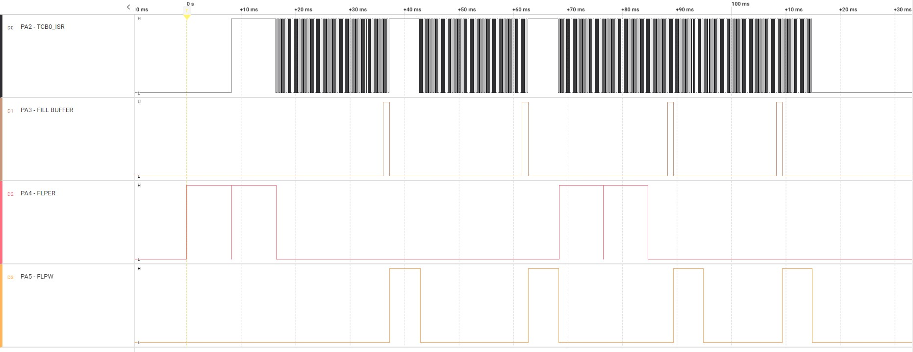

## Summary
<!-- Summarize what the example has shown -->
By completing this example, the user will
1. Be shown the benefits of having the program memory split into two, NRWW and RWW.
2. Be able to compare these benefits against the standard way AVR 8-bit microcontrollers operates.